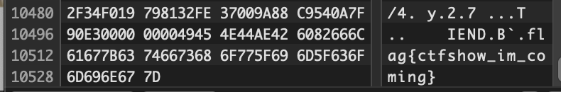

# CTF.Show - Rookie Questions (CTF秀 - 萌新题)

#### This page will be a mixutre of Chinese and English just becasue the platform is in Chinese but I'm not sure on the terminologies in Chinese.

Platform: [CTF.Show](https://ctf.show/)

## 萌新认证

This flag is for accessing the questions for newbies, it can only be aquired by heading to the QQ group chat and asking the group owner.

## 萌新_密码1

###Question:
密文： 53316C6B5A6A42684D3256695A44566A4E47526A4D5459774C5556375A6D49324D32566C4D4449354F4749345A6A526B4F48303D

提交格式：KEY{XXXXXXXXXXXXXX}

### Steps:
As the encoded string does not contain a character larger than F, we can assume that it is Hex. 
From that we got a Base64 string, decode that and we get a string that seems like a simple rail fence cipher.
Run it through a rail fence cipher decoder and you will get the flag.

### Flag:
> KEY{dffb06a33eeeb0d259c84bd8cf146d08-}

## 萌新_密码2

### Question:
出题人已累，随便敲了几下键盘。。。 rdcvbg 2qase3 6tghu7

flag格式KEY{XXXXXX}

### Steps:
Looking at the hints provided in the text, it tells you that the person is tired and pressed on the keyboard randomly. Taking that as a hint and looking at the keyboard, we can see that each set of characters creates a circle around a letter. With the three letters combined, we have our flag.

### Flag:
> KEY{f w y}

## 萌新 密码3

### Question: 

题目名称：我想吃培根 题目描述： -- --- .-. ... . ..--.- .. ... ..--.- -.-. --- --- .-.. ..--.- -... ..- - ..--.- -... .- -.-. --- -. ..--.- .. ... ..--.- -.-. --- --- .-.. . .-. ..--.- -- -- -.. -.. -- -.. -- -.. -- -- -- -.. -.. -.. /-- -.. -- -.. -.. --/ -- -- -- -- -- /-- -.. -.. -- -.. -- /-- -.. -.. -- 

格式：flag{***********}

### Steps:
It's quite obivious that this is morse code so run it through a morse code decoder. 

From that we get the output:

> MORSE_IS_COOL_BUT_BACON_IS_COOLER_MMDDMDMDMMMDDD MDMDDM MMMMM MDDMDM MDDM

From the title of the question (I want to eat bacon) and the output we got, we can safely assume that it is referring to the Bacon Cipher.

Replacing the Ms with A and Ds with B and running it through a decoder, we get the output:

> GUOWANG

This will be the text within the flag.

### Flag:

> flag{GUOWANG}

## 萌新 密码#4

### Question:
QW8obWdIWF5FKUFSQW5URihKXWZAJmx0OzYiLg==

### Steps:
Decoding the string we get the following string:

> Ao(mgHX^E)ARAnTF(J]f@&lt;6".

Running this through a Base85 decoder and we will get the flag.

### Flag:
> flag{base_base_base}

## 萌新 隐写3

### Question:

### Steps:
The flag is on the image.

### Flag:
> flag{xinti_gkd}

## 杂项1

### Question:

小明想给心爱的妹子表白很久，可是不知道怎么开口，你能帮帮小明吗？

已知 md5(表白的话+ctf)=ed400fbcff269bd9c65292a97488168a

提交flag{表白的话}

### Steps:

From the question, we know that the string is a md5. Run it through a cracker and we get the answer:

> helloctf

Going back to the hint, ("confession"+ctf)=string, remove "ctf" from the output we've got the flag.

### Flag:
> flag{hello}

## 杂项2

### Question:
小明终于找到了萌新码，开始了自己的CTF冒险征程。

工具地址：https://www.lanzous.com/i9h1lfi

提交flag{XXXXX}

### Steps:
With the tool provided as a hint (The tool is winhex), we know that we should be looking at the image with a hex editor.
Scrolling through the hex, the flag is found at the end of the hex.

### Flag:
> flag{ctfshow_im_coming}

## 萌新 杂项3

### Question:
大家好我是小萌新羽，前不久我的一个朋友给我了一张银行卡，他说里面有一大笔钱，但是他只告诉我他的生日是九七年十月一日，你能帮我猜猜他的银行卡密码是多少吗，哦对，这个朋友有个小名叫小五。

flag格式：flag{银行卡密码}

### Steps:
From the question we were given 3 pieces of information, the person's birthday is 1st October, 1997, his nickname is 小五（"Five"）and we are trying to guess a bank card pin.

A pin is usually 6 digits and we have 1997, 10, 01, 05 to work with, since given these numbers and the difficulty of the question, we can make a safe assumption that all four must be used. This cuts down the numbers to 97, 10, 1 and 5.

The rest is mere bruteforce for the order of the digits.

### Flag:
> flag{971015}

## 杂项5

### Question:
小明如愿以偿的打开了压缩包，可是眼前的文字自己只能认识FBI，其他的都不认识，而且屏幕出现了一句话，你能帮小明找到这句话的意思吗？

>FBI    No under 18
>
> i was always Fond of visiting new scenes, and observing strange characters and manners. even when a mere chiLd i began my travels, and made mAny tours of discovery into foreiGn {parts and unknown regions of my native City, to the frequent alarm of my parents, and The emolument of the town-crier. as i grew into boyhood, i extended the range oF my obServations. my holiday afternoons were spent in rambles about tHe surrounding cOuntry. i made myself familiar With all its places famous in history or fable. i kNew every spot where a murder or robbery had been committed, or a ghost seen. i visited the neighboring villages, and added greatly to my stock of knowledge,By noting their habits and customs, and conversing with their sages and great men.}

### Steps:
When inspecting the document, we see that the capitalization is a bit weird. Picking out the capitalize characters and it reveals the flag.

### Flag:
> FLAG{CTFSHOWNB}

## 杂项6

### Question:
小明的压缩包又忘记密码了？他去电脑维修店去修，人家扔出来说这个根本就没有密码，是个假密码。小明懵了，明明有密码的啊，你能帮帮小明吗？

### Step:
(The zip file opened up perfectly fine on MacOS without asking for a password)

Knowing that a fake password has been set, we should check the file under a hex editor. Knowing the file signature of zip is 50 4b 01 02 (PK) and if right after 14 00 is 01 00 or 09 00 means that it is a fake encryption, we can identify the location (Byte 67) that caused the encryption. Changing the 09 back to 00 would remove it and allow us to see the txt file with the flag in it.

### Flag:
> flag{c_t_f_s_h_o_w}

